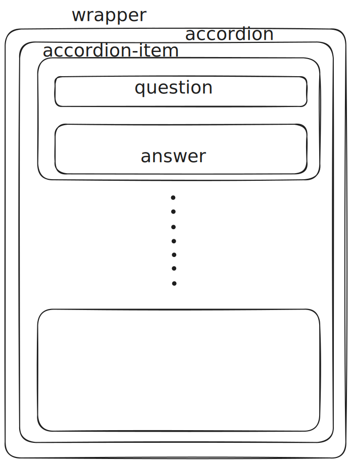

# Project 1: Accordion Component

Acting at first as a copycat, I solved the same challenge on my own from scratch.
I had identified some issues that affect the user experience (UX) such as:
- When the an accordion item is clicked, that is it is expanded, and then the state of the component changes to multi-select then the previous expanded accordion elements cannot be closed.
- Same holds true when you switch from multi-select back to single select.
- The "+" sign remains "+" even after expansion.

Thus, I went the extra mile of solving again the challenge on my own and tackling the above issues.

My initial action was to design the component by visualizing the different `
` elements that are needed:
